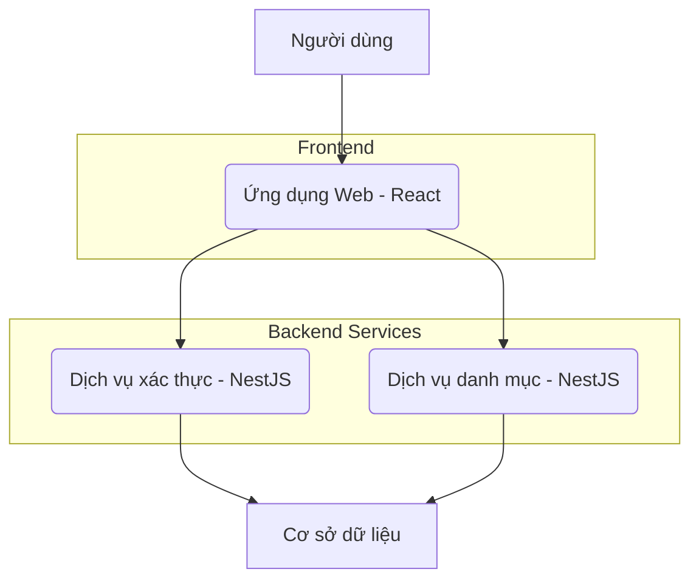

# Product Context

This file provides a high-level overview of the project and the expected product that will be created. Initially it is based upon projectBrief.md (if provided) and all other available project-related information in the working directory. This file is intended to be updated as the project evolves, and should be used to inform all other modes of the project's goals and context.
2025-10-07 09:36:19 - Log of updates made will be appended as footnotes to the end of this file.

*

## Project Goal

*   

## Key Features

*   

## Overall Architecture

*   Dự án này là một monorepo được quản lý bởi Nx, bao gồm các thành phần chính sau:
    *   **Ứng dụng Web (Frontend)**: Được xây dựng bằng React (TypeScript), sử dụng Vite và Tailwind CSS. Đây là giao diện người dùng mà người dùng tương tác trực tiếp. Nó giao tiếp với các dịch vụ backend thông qua API.
    *   **Dịch vụ xác thực (Backend)**: Một ứng dụng NestJS (TypeScript) chịu trách nhiệm xử lý các chức năng liên quan đến xác thực người dùng.
    *   **Dịch vụ danh mục (Backend)**: Một ứng dụng NestJS (TypeScript) khác, có thể được sử dụng để quản lý các danh mục hoặc dữ liệu tương tự.
    *   **Cơ sở dữ liệu**: Các dịch vụ backend (auth, category) tương tác với một cơ sở dữ liệu chung hoặc riêng biệt để lưu trữ và truy xuất dữ liệu.

2025-10-08 09:24:32 - Ứng dụng `auth` là một dịch vụ backend NestJS (TypeScript), cung cấp API cho các chức năng xác thực.
2025-10-08 09:25:06 - Ứng dụng `web` là một ứng dụng frontend React (TypeScript) sử dụng `react-router-dom` để quản lý các tuyến đường.